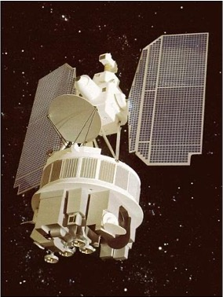
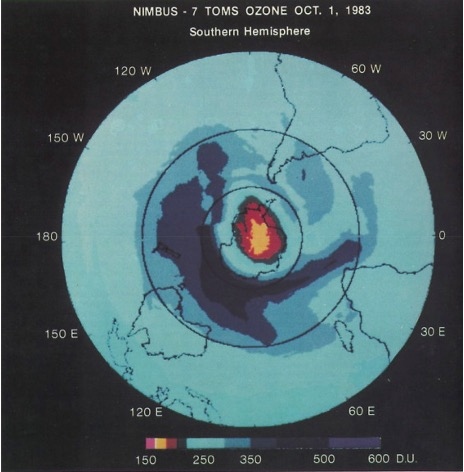

# Summary - Introduction
<br>
<br>
<div style="text-align: justify;">

 The<b>Total Ozone Mapping Spectrometer (TOMS)</b> is a groundbreaking sensor designed to measure ozone levels by detecting backscattered ultraviolet (UV) radiation. First launched in 1978 aboard NASA’s<b>Nimbus-7</b>  satellite, TOMS introduced a new era of atmospheric monitoring. It was later deployed on several other satellites, including the Soviet <b>Meteor-3</b> (1991), Japan’s <b>ADEOS</b> (1996), and NASA’s <b> Earth Probe</b> (1996), extending its mission to monitor ozone and atmospheric composition for nearly three decades.
</div>


<br>
<div style="text-align: justify;">
Its design of looking straight down at Earth <b>(called nadir viewing)</b>  and ability to scan across a wide range of UV wavelengths made it a powerful tool for studying the ozone layer. TOMS not only advanced scientific understanding but also demonstrated how satellite data could drive global environmental action, setting a standard for future missions.
</div>

---
# Summary - Design

.pull-left[
<br>
```{r, echo=FALSE, message=FALSE, out.width='70%'}
## echo=FALSE hides the code

library(knitr)
library(kableExtra) 
library(magrittr)    

# Create your data frame
my_data <- data.frame(
  Parameter = c("Sensor Type", "Viewing Angle", "Spectral Range", "Scanning Mechanism", "Spatial Resolution", "Field of View", "Swath Width"),
  Details = c(
    "Passive sensor (measures backscattered UV radiation)",
    "Nadir viewing (looks straight down at Earth)",
    "Six UV wavelengths (310–380 nm)",
    "• Scans ±51° from nadir in 3° steps<br/>• Swath width: ~2,700 km",
    "50 km × 50 km (average: 62 km × 62 km)",
    "Instantaneous Field of View (IFOV): ~0.052 radians",
    "~2,700 km"
  ),
  stringsAsFactors = FALSE
)

# Create HTML table without header, making the first column bold
kable(my_data, format = 'html', col.names = NULL, escape = FALSE) %>%
  kable_styling("bordered", full_width = F, font_size= "15px", position = "center") %>%
  column_spec(1, bold = TRUE)
```
<p style="text-align: left; font-size: 15px;">
* Smaller IFOV allows for finer spatial resolution, meaning the ability to distinguish smaller features on the Earth's surface
</p>

]

.pull-right[

```{r, echo=FALSE, out.width='70%', fig.align='center'}

```

<p style="text-align: center; font-size: 12px; color: gray;">
image credit: NASA
</p>

]

---
# Applications - Ozone Monitoring
 

<div class="container">
    <div class="left">
        <ul>
            <li>In May 1985, a paper published by Farman, Gardiner, & Shanklin presented the first scientific evidence of the Antarctic ozone hole, showing a 50% reduction in ozone levels over Antarctica during the spring months.</li>
            <li>In August 1985, Bhartia et al. presented the first map of the Antarctic Ozone Hole from TOMS data at the IAGA/IAMAP conference, confirming that the observed ozone depletion was a continent-wide phenomenon.</li>
            <li>In 2005, Stolarski et al. highlighted how TOMS faced calibration issues due to a degrading mirror, causing some uncertainty in ozone measurements, especially by 2002. However, this uncertainty was minor when comparing the 2002 ozone hole to earlier years.</li>
            <li>The last TOMS mission, the Earth Probe, operated until 2006. It has since been succeeded by advanced sensors such as Aura's Ozone Monitoring Instrument (OMI), the Suomi NPP's Ozone Layer Monitoring Suite (OLMS), and the Copernicus Sentinel-5P satellite.</li>
            <li>The discovery and subsequent mapping of the ozone hole significantly influenced international policy, leading to the adoption of the Montreal Protocol in 1987. This treaty aimed to phase out the production and consumption of ozone-depleting substances, ultimately contributing to the recovery of the ozone layer.</li>
        </ul>
    </div>
    <div class="right">
        ```{r, echo=FALSE, out.width='100%', fig.align='center'}
        
        ```
        <p style="text-align: center; font-size: 12px; color: gray;">
image credit: NASA
</p>
    </div>
</div>
---
# Applications - Volcanic Eruption Tracking

- Krueger et al. discussed how the 1982 El Chichón eruption in Mexico significantly advanced the monitoring of volcanic sulfur dioxide (SO₂) from space, showcasing the capabilities of the TOMS in detecting and quantifying SO₂ emissions.

--

- For eruption analysis, TOMS provides three valuable products: total ozone anomalies, the Sulfur Dioxide Index, and the Aerosol Index, which facilitate comprehensive assessments of volcanic activity.

--

- The TOMS total ozone algorithm was ineffective in the presence of volcanic clouds due to the similar absorption spectra of SO₂ and ozone. Consequently, an atmospheric correction approach was developed to accurately retrieve SO₂ concentrations.

--

- This event led to the development of methodologies for satellite-based volcanic gas monitoring, establishing a foundation for future technologies and improving global understanding of volcanic activity and its environmental impacts.

---
# Reflections


- The ozone hole is something I thought I understood well, but diving into TOMS revealed gaps in my knowledge. Learning how it was discovered—starting with ground sensors at the Halley Research Station, then evolving into early satellites like TOMS—showed me how much innovation went into tracking this global issue. What was really interesting  was how these early efforts paved the way for modern tools like OMI and TROPOMI, which now monitor not just ozone but pollutants like methane and aerosols in real time.

--

- I was particularly intrigued by the nadir viewing technique used in these sensors, as it was new to me. This led me to explore other observation methods, like lidar and polar-orbiting satellites, and I realized even familiar systems like Landsat 8 and Sentinel-2 use similar techniques and this helped me understand how these design choices shape what we can measure.

--

- One study I came across stood out (mentioned in the applications slide) : researchers had to correct ozone data after a sudden atmospheric warming event disrupted wind patterns. This real-world example connected well with what we studied in week three, illustrating the complexities of atmospheric science. 


---
# Reflections

- Overall, seeing how far we’ve come from TOMS’ basic ozone maps to TROPOMI’s hyper-detailed pollution tracking  is inspiring. These tools aren’t just for scientists; they give communities and governments the data to tackle issues like methane leaks . Sure, they might miss hyper-local details (like a single factory’s emissions), but their big-picture insights are vital for policy and global cooperation.  As someone starting out in this field, it’s motivating to see how satellite data bridges science and action—and why learning these tools matters in an era facing significant environmental challenges. 

---
# References

<div class="ref">
    <ul>
        <li> 
            Bhartia, P. K., Heath, D. F., & Fleig, A. F. (1985, August). Observation of anomalously small ozone densities in south polar stratosphere during October 1983 and 1984. In Symposium on Dynamics and Remote Sensing of the Middle Atmosphere, 5th Scientific Assembly (Vol. 517).
        </li>
        <li>
            Bhartia, P. K., & McPeters, R. D. (2018). The discovery of the Antarctic Ozone Hole. Comptes Rendus. Geoscience, 350(7), 335–340. <a href="https://doi.org/10.1016/j.crte.2018.04.006" target="_blank">https://doi.org/10.1016/j.crte.2018.04.006</a>
        </li>
        <li>
            eoPortal. (2012). TOMS (Total Ozone Mapping Spectrometer). Satellite Missions Catalogue. from <a href="https://www.eoportal.org/satellite-missions/toms#sensor-complement-toms-total-ozone-mapping-spectrometer" target="_blank">https://www.eoportal.org/satellite-missions/toms#sensor-complement-toms-total-ozone-mapping-spectrometer</a>
        </li>
        <li>
            Farman, J. C., Gardiner, B. G., & Shanklin, J. D. (1985). Large losses of total ozone in Antarctica reveal seasonal ClO<sub>x</sub>/NO<sub>x</sub> interaction. Nature (London), 315(6016), 207–210. <a href="https://doi.org/10.1038/315207a0" target="_blank">https://doi.org/10.1038/315207a0</a>
        </li>
        <li>
            Krueger, A., Krotkov, N., Carn, S., Taran, Y. A., Macias, J. L., & Espindola, J. M. (2008). El Chichon; the genesis of volcanic sulfur dioxide monitoring from space. Journal of Volcanology and Geothermal Research, 175(4), 408–414. <a href="https://doi.org/10.1016/j.jvolgeores.2008.02.026" target="_blank">https://doi.org/10.1016/j.jvolgeores.2008.02.026</a>
        </li>
        <li>
            NASA's Earth Observing System. Nimbus 7. from <a href="https://eospso.nasa.gov/missions/nimbus-7" target="_blank">https://eospso.nasa.gov/missions/nimbus-7</a>
        </li>
        <li>
            NASA Earth Observatory. (2012). Watching the ozone hole before and after the Montreal Protocol. <a href="https://earthobservatory.nasa.gov/images/79198/watching-the-ozone-hole-before-and-after-the-montreal-protocol" target="_blank">https://earthobservatory.nasa.gov/images/79198/watching-the-ozone-hole-before-and-after-the-montreal-protocol</a>
        </li>
        <li>
            Stolarski, R. S., McPeters, R. D., & Newman, P. A. (2005). The Ozone Hole of 2002 as Measured by TOMS. Journal of the Atmospheric Sciences, 62(3), 716-720. <a href="https://doi.org/10.1175/JAS-3338.1" target="_blank">https://doi.org/10.1175/JAS-3338.1</a>
        </li>
    </ul>
</div>

---
class: center, middle
background-color: #002D62


# Thanks!

Slides created via the R package [**xaringan**](https://github.com/yihui/xaringan).

